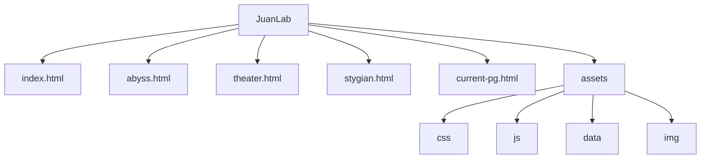

# JuanLab

[](https://juan0177.github.io/JuanLab/)
[](https://github.com/juan0177/JuanLab)

Sito personale pubblicato su GitHub Pages con tema dark, sfondo animato e contenuti organizzati in pagine dedicate.

Live: [https://juan0177.github.io/JuanLab/](https://juan0177.github.io/JuanLab/)

## ✨ Contenuti del progetto

Il sito include quattro sezioni principali:

- Spyral Abyss
- Imaginarium Theater
- Stygian Onslaught
- Guida PG attuale

## 🧭 Pagine principali

- Home: `index.html`
- Spyral Abyss: `abyss.html`
- Imaginarium Theater: `theater.html`
- Stygian Onslaught: `stygian.html`
- Guida PG attuale: `current-pg.html`

## 🌳 Struttura del progetto



## Avvio locale

Non è richiesto alcun build step. Il sito è statico e può essere visualizzato in locale in due modi:

### Con Live Server (VS Code)

1. Apri `index.html`
2. Fai clic destro
3. Seleziona "Open with Live Server"

### Con Python

```bash
python -m http.server 8080
```

Quindi apri `http://localhost:8080` nel browser.

> Nota: aprire i file direttamente con `file://` non è consigliato, perché i dati JSON vengono caricati tramite `fetch()`.

## Come aggiornare i contenuti

### Spyral Abyss

1. Crea o modifica un file nella cartella `assets/data/abyss/` (ad esempio `2026-08-16.json`)
2. Aggiorna `assets/data/abyss/index.json` con periodo e nome del file

Schema minimo:

```json
{
  "period": "Periodo live: 16 Agosto 2026 ~ 16 Settembre 2026",
  "gimmick": "Descrizione buff globale",
  "buff_first": "Descrizione buff prima meta",
  "buff_second": "Descrizione buff seconda meta",
  "slots": [
    {
      "slot": 1,
      "label": "Piano 12-1 Prima meta",
      "enemies": [
        { "id": "Fungus_Raptor", "level": 100, "hp": 1192502, "quantity": 1 }
      ]
    }
  ]
}
```

L'`id` del nemico deve corrispondere alla chiave usata dal progetto, derivata dalle icone in `assets/img/enemies/` e dal lookup in `assets/data/enemies.json`.

### Imaginarium Theater

1. Crea o modifica un file in `assets/data/theater/` (ad esempio `2026-09-01.json`)
2. Aggiorna `assets/data/theater/index.json`

Campi principali:

- `period`
- `fixed_buff`
- `mechanics` (`recommended_elements`, `opening_characters`, `guest_stars`)
- `selected_mode`
- `modes` (`lunar`, `visionary`, `hard`, `normal`, `easy`)
- `strategies`

Per avere la sezione Strategie presente ma vuota, usa:

```json
"strategies": []
```

Esempio di singola strategia:

```json
"strategies": [
  {
    "title": "Gestione energia",
    "points": [
      "Priorità ai personaggi con ricarica alta",
      "Conserva i personaggi di punta per gli atti boss"
    ]
  }
]
```

### Guida PG attuale

1. Modifica il contenuto della pagina in `current-pg.html`
2. Se serve un ritocco visivo, aggiorna `assets/css/current-pg.css`
3. Se vuoi cambiare l’immagine di copertina, sostituisci il file in `assets/img/guides/` o aggiorna il path nel markup

Questa sezione raccoglie la guida del personaggio attuale, con struttura statica e stili dedicati. Il nome del personaggio può cambiare senza cambiare il nome della sezione.

### Stygian Onslaught

1. Crea o modifica un file in `assets/data/stygian/`
2. Aggiorna `assets/data/stygian/index.json`

Campi principali:

- `version`
- `period`
- `description`
- `selected_difficulty`
- `overview`
- `difficulties`

Ogni difficoltà contiene un array `bosses`, e ogni boss usa `enemy_id` per recuperare nome e immagine da `assets/data/enemies.json`.

Schema minimo:

```json
{
  "version": "v6.7",
  "selected_difficulty": "6",
  "overview": {
    "title": "Panoramica rotazione",
    "description": "Note generali sulla rotazione",
    "points": []
  },
  "difficulties": {
    "6": {
      "label": "Difficoltà 6",
      "notes": "Focus generale",
      "bosses": [
        {
          "enemy_id": "Monitor_02",
          "hp": 14480438,
          "level": 100,
          "advantages": ["Cryo ed Electro"],
          "disadvantages": ["Personaggi melee"],
          "resistances": {
            "pyro": "10%",
            "hydro": "10%",
            "dendro": "10%",
            "electro": "10%",
            "anemo": "10%",
            "cryo": "10%",
            "geo": "10%",
            "physical": "10%"
          },
          "mechanics": [
            {
              "title": "Nome meccanica",
              "description": "Descrizione breve"
            }
          ]
        }
      ]
    }
  }
}
```

### Informazioni sui nemici

File: `assets/data/enemies.json`

Regole utili:

- `name` e icona devono essere coerenti
- `info` deve essere un array di stringhe
- se non hai consigli, usa `"info": [""]` oppure `"info": []`
- usa sempre doppi apici standard `"` (evita virgolette tipografiche)

## Deploy

```bash
git add .
git commit -m "Aggiornamento contenuti"
git push
```

GitHub Pages pubblica di solito entro 1-2 minuti.
